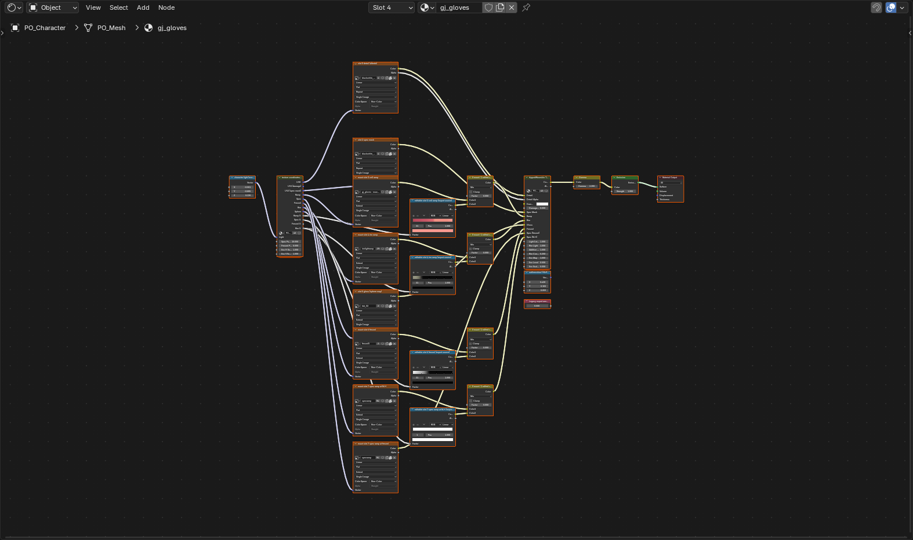
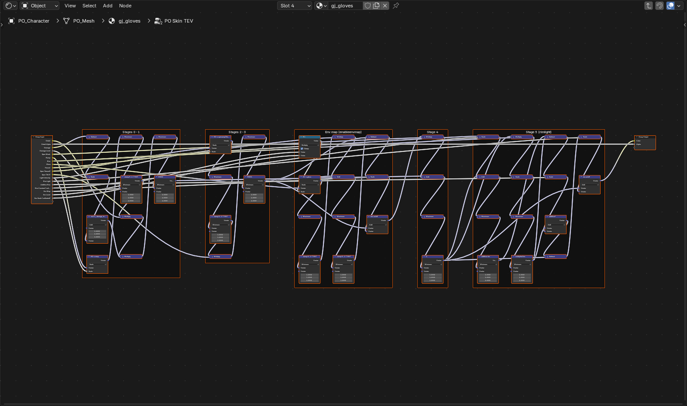
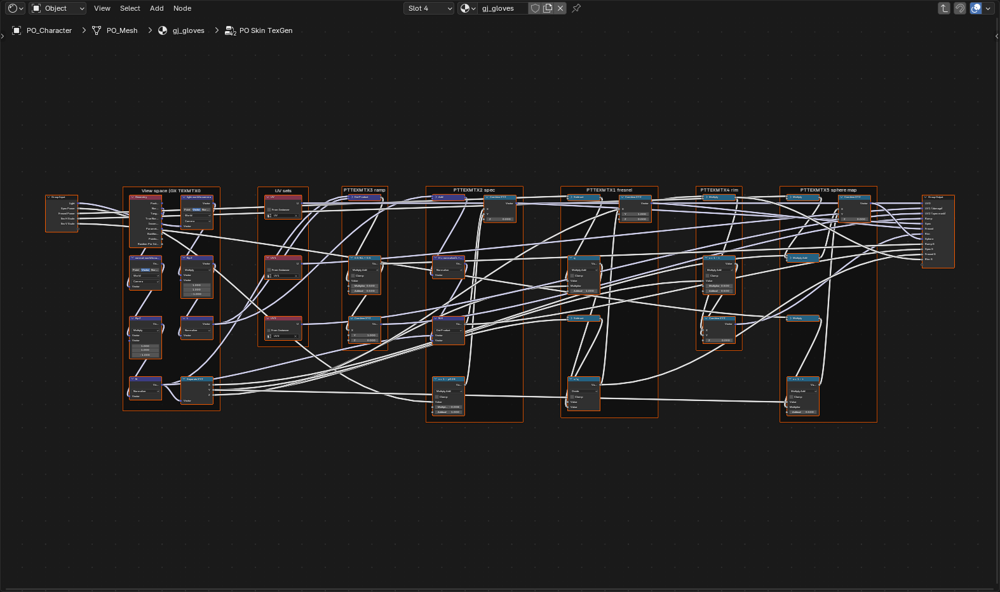

# Punch-Out!! Wii — Materials & Shading

Everything about the `hippodiffuseskin` material: how it decodes, how it's rebuilt in Blender,
how you author new ones, and how it gets written back.

---

## The one thing to understand first

Every boxer material in the game is the **same shader preset** — `hippodiffuseskin`, one 204-byte record, eight fixed texture slots. All 95 characters.

Second: **the "diffuse ramps" are not baked lighting.** Measured against what the same surface
actually spans in-game:

| ramp        | its own luminance span | in-game span |
| ----------- | ---------------------- | ------------ |
| `bh_skin`   | 0.33 → 0.52            | 0.66 → 0.86  |
| `bh_gloves` | 0.18 → 0.25            | 0.34 → 0.56  |
| `bh_hair`   | 0.13 → 0.22            | 0.38 → 0.61  |
| `bh_shoes`  | 0.29 → 0.43            | 0.55 → 0.77  |

They're dark colour LUTs addressed by the interpolated authored normal/light dot product. The
TEV stages multiply that lookup by detail, then add masked specular/rim/HDR terms. Blender scene
lights are deliberately excluded: the completed GX colour is sent through Emission so it is not
lit a second time by a PBR model.

---

## The material record (0xB016, 204 bytes)

The mesh record points at it: `materialOffset` @36. Two other hashes live in the mesh record and
they are **not** interchangeable:

- **@16 = shader name** → `hippodiffuseskin` on every mesh of every boxer. Selects the shader in
  `main.dol`. Never change it.
- **@20 = material name** → `bearhugger_mats/bh_gloves`, `gj_mats/gj_skin`, `lm_mats/helmet`.

Every field is named: the shader descriptor (vtable `8033B270`) returns a parameter table of
`{name hash, type, offset}` covering the whole record. *Runtime* fields are zero on disk and written
by the game each frame; editing them does nothing.

| offset | field | type | notes |
| --- | --- | --- | --- |
| `+0x00`..`+0x38` | `nlg_diffuse`, `nlg_damagemap`, `nlg_specmask`, `nlg_cellramp`, `nlg_rimlightmap`, `nlg_gloss`, `nlg_fresnel`, `nlg_specramp` | 8 × texture ref | slots 0–7; `{u32 hash, u16 cache, u8 control, u8 filter}` |
| `+0x40` | `skinmatrices` | runtime | |
| `+0x48`..`+0x74` | `showtranslucency`, `shadowmapoutput`, `dynamiccharacteralpha`, `viewspeclightdirection` (vec3), `viewspeclightintensity`, `blackwhitesilhouette`, `blendcolourint`, `normalextension`, `edgeaatype`, `usefeoutlinecolour` | runtime | light, outline shell, silhouette |
| `+0x78` | `allowtranslucency` | bool | |
| `+0x7C` | `outlinetranslucency` | bool | |
| `+0x80` | `fresnelpower` | f32 | fresnel texgen exponent |
| `+0x84` | `specpower` | f32 | gloves 64, skin 32, cloth 2; selects the specramp row |
| `+0x88` | `isglowing` | bool | 0 on every fighter |
| `+0x8C` | `antialias` | bool | 0 on every fighter |
| `+0x90` | `rimlight` | bool | rim stage on/off |
| `+0x94` | `additiverimlight` | bool | rim added vs multiplied |
| `+0x98` | `enabledamagetexture` | 0/1/2 | damage stage (technique 3/4) |
| `+0x9C` | `outlinecolour` | RGBA f32 | **the outline colour, not a lighting tint** |
| `+0xAC` | `damagelevellow` | runtime | |
| `+0xB0` | `enableenvmap` | bool | gloss sphere-map stage (technique 2/4) |
| `+0xB4` / `+0xB8` | `envmaphorizscale` / `envmapvertscale` | f32 | sphere-map scale |
| `+0xBC` | `envmaptexturelevel` | f32 | gloss strength |
| `+0xC0` | `noblendcolour` | bool | |
| `+0xC4` | `alphaobject` | f32 | |
| `+0xC8` | `damagelevelhigh` | runtime | |

Earlier versions of this page called `+0x9C` a "tint" and `+0xA8` "alpha"; `+0xA8` is the alpha
component of `outlinecolour`. The exporter still stores the record verbatim for untouched
materials, so nothing that was already exported is affected. Which of these flags change a
fighter in game has not been tested one by one yet.

Source: `decomp/research/rendering_pipeline.md` and `shader_props.json` (the separate executable
research repository).

---

## Naming

The current material exporter calls `nlg_hash.string_to_hash` with its ASCII-folding compatibility
default. Keep authored material and texture resource names lowercase unless that resource family's
case policy has been independently verified; the global registry contains both policies.

| what           | pattern                 | examples                                          |
| -------------- | ----------------------- | ------------------------------------------------- |
| material (@20) | `<abbrev>_mats/<part>`  | `bearhugger_mats/bh_gloves`, `gj_mats/gj_skin`    |
| texture        | `<archive-name>/<name>` | `bearhugger/bh_skin`                              |
| globals        | `global/…`              | `global/black`, `global/white`, `global/specramp` |

The prefix is free-form — Nintendo used `bearhugger_mats/`, `gj_mats/`, `lm_mats/`, `dk_mats/`,
`kh_mats/`, `sp_mats/` with no consistent rule, and DK ships `dk_mats/ torso` with a stray
leading space.

**The name is the only signal for a damage material.** There is no flag in the material record —
verified, damage records are byte-identical to normal ones apart from offsets. Anything matching
`DAMAGE_NAME_HINTS` (`damage`, `blackeye`, `welt`, `bruise`, `_bump`, `bumps`, `/mark`) gets the
Normal/Hurt texture control. These records include required replacement cheek, lip, and torso
geometry, so their polygons remain visible in both states. Normal substitutes white for slot 1;
Hurt enables slot 1 as the game's mostly-white bruise/mark multiply texture. Slot 1 uses the
archive's independent texture-coordinate set 1, imported as the `UV_Damage` UV map; using the
skin UV map is what caused the old stretched rectangles and misplaced damage.

`OPTIONAL_DAMAGE_NAME_HINTS` is separate. DK's `dk_bandage` is actual forehead overlay geometry,
not a replacement face surface, so `PO_DamageVis` makes that material transparent in Normal and
visible in Hurt. Keeping this distinction prevents an uninjured DK from wearing the bandage while
preserving the geometry and original material for editing and export.

The arena prop family `hippodiffusenonskin` uses the same decoded TEV inputs relevant here:
slot 0 detail, slot 2 specular mask, slot 3 colour LUT, slot 4 rim LUT and slot 7 specular LUT.
DK's bananas use this family; the barrel uses `hippodiffuseskin`. Both sample the repaired source
LUT image directly in preview, with the editable ColorRamp available only through `PO_RampSource`.
The generated one-row LUT datablock is explicitly updated before it is packed into the `.blend`;
without that commit Blender saved an allocated black image and both props rendered almost black.

Use **3D Viewport ▸ N ▸ PO Tools ▸ Materials and textures ▸ Fighter damage state** to switch
between **Normal** and **Hurt**, cycle each state's materials, replace a detail or hurt-overlay
image, or edit the active material's diffuse/toon ramp. Reloading the add-on upgrades an
already-open slot-1 graph in place. Re-import only if the file predates slot-1 decoding.

---

## Files

```
po_shader.py            the shader graph, presets, fingerprints,
                        build_materials_from_archive()  — scene-free, testable
io_import_punchout.py   import only; calls po_shader for materials
io_export_punchout.py   geometry/slot export AND po_export_materials
nlg_material.py         204B record read/write, CLI (list/set/tint/spec/nohdr/addtex)
nlg_texture.py          CMPR codec; Pillow optional (Blender ships without it)
```

Both add-ons import `po_shader`, so an authored material and an imported one are the same graph
by construction and cannot drift apart.

---

## Authoring

```python
mat = po_new_material("bry_jacket", "cloth")   # skin/cloth/hair/glove/metal/boot/flat
```

For a regular imported FBX/OBJ material, no Python is required: make its diffuse image the only
Image Texture wired to Principled **Base Color**, make that material active, then run
**F3 → `PO: Make Custom Game Material`**. Choose a target mesh slot and a surface-response preset.
The operator moves the bitmap into `PO_Detail`, assigns `po_slot`, and makes a fresh material
record. This is the required bridge between a conventional Blender material and the Wii shader.

**Do not stop at wiring an image into Principled Base Color.** That input is temporary conversion state,
not a Punch-Out texture slot; without the conversion it can be flattened by the colour bake and the
game continues using the target slot's source material. A converted material owns a new/forked
detail texture and a rebuilt record, while the mesh continues to use the game's existing
`hippodiffuseskin` program for lighting and reflection.

Preset ramp endpoints are the real measured values from Bear Hugger's shipped ramps, so a fresh
template already sits in the range the game's own art occupies.

### How the Blender graph maps to the game

Every fighter material is built from two shared node groups, transcribed from the executable
(symbolic execution of the draw functions; see the decomp notes above):

- **PO Skin TexGen** — geometry in, the texture coordinates GX generates out: UV0/1/2, the
  half-Lambert ramp coordinate `0.5·N·L + 0.5`, specular `N·H` with row `specpower/128`, fresnel,
  rim (`Nz/2, (1 − Ny)/2`) and the sphere map. All in GX view space.
- **PO Skin TEV** — the sampled textures and the record's switches in, the TEV stages out:
  `REG0 = K0 × ramp × detail (× damage)`, `C = K0 × spec(fresnel) × spec(N·H)`, optional gloss,
  `C = REG0 + C × specmask`, then the additive or multiplied rim. Every stage clamps to 0..1 as
  the hardware does.



Open either group (select it, **Tab**) to read or change the math; each section is a labelled
frame.




 Both groups are shared, so an edit applies to every material at once. The texture slots
stay at the material's top level, one node per record slot:

| node | slot | what it is |
| --- | --- | --- |
| `PO_Detail` | 0 | albedo image (UV0) |
| `PO_Damage` | 1 | hurt overlay (UV1), shown by the Normal/Hurt toggle |
| `PO_SpecMask` | 2 | specular mask (UV2) |
| `PO_Ramp` | 3 | cell ramp. The ColorRamp is what you edit and what exports |
| `PO_RimRamp` | 4 | rim ramp |
| `PO_Hdr` + `PO_Fresnel` | 5, 6 | gloss sphere map and its fresnel |
| `PO_SpecRamp` | 7 | spec ramp; the game samples it twice (at fresnel and at N·H) |
| `PO_*Texture` / `PO_*Source` | — | the exact source texture, and the switch between it and your edit |
| `PO_LightVector` | — | the character light (world space, towards the light) |
| `PO_Tint` | — | `outlinecolour` (+0x9C); round-trips, not used for shading |

The viewport previews the exact source texture until you edit a ramp; the edit then shows
automatically (flip `PO_*Source` back to 0 to compare). Shared textures such as
`global/specramp` load from `global.dict`: import once from the extracted dump in a session, or
set `PO_ART_ROOT`, before importing a mod stored elsewhere.

The default light is the opponent's in-bout light, normalize(−2.5, −3.65, 1.0), which matches
Dolphin footage of Glass Joe; cutscenes use (2.5, 3.65, 1.0). Two TEV constants are calibrated
against retail footage rather than decoded, and are separate group inputs so they stay visible:
the rim constant (1/4) and the gloss level scale (0). The old fitted gain, lift and glow values
are gone.

---

## Export

```python
po_export_materials(obj, r"...\art\characters\bearhugger.dict")
```

Bakes every ColorRamp to a real ramp texture, writes the images as CMPR, rebuilds `0xB016` with
one record per material slot, repoints every mesh's `materialOffset`, and writes your material
name to @20.

### The governing rule: don't touch what wasn't edited

A repaint cannot survive a 32-stop ColorRamp resample plus a re-encode through our own CMPR
compressor, and several record fields have no editor yet. So import stamps every material with its
original 204-byte record, its 8 slot hashes, and a fingerprint (`fp_ramp` / crc32 `fp_image`) of
every ramp and image. Export writes untouched materials back **verbatim** and re-bakes only the
individual slots whose fingerprint moved (`po_shader.dirty_slots`).

`force=True` re-derives everything, if you want to see what the bake actually costs.

### Limits

- **CMPR is fixed-size per dimensions.** Overwriting an existing texture must match the size the
  archive allocated (ramps ship at 128×4 and 256×8, not our 128×8 default). Ramps are re-rendered
  at the existing size automatically; a painted image whose size clashes is a hard error.
- **Textures store a MIP CHAIN, and the record's count at `+0x0B` is load-bearing.** The game
  reads that many levels contiguously from `dataOffset`, so anything that writes a texture has to
  write the whole chain. 20 of the referee's 31 textures are mipped; `ref_teeth_spec` is 64×64
  with 4 levels and the next texture starts 2720 bytes later, not 2048. Two consequences:
  recolouring only level 0 leaves the original art showing at distance, and copying only level 0
  while cloning the header makes the game read past the end — a hang, not a glitch.
- **Uniform CMPR blocks must be 4-colour opaque (`c0 > c1`).** `c0 == c1` selects 3-colour
  punch-through, where index 3 is transparent black. Our decoder reads index 0 correctly either
  way, so it looks perfect offline and bands on console. Pure black needs the colour at the
  _low_ endpoint with index 1, since nothing sorts below 0.
- **The colour bake and the material export used to fight.** The bake writes ONE flat colour into
  a slot's ramp and runs _first_; `po_export_materials` then writes untouched materials back
  verbatim, so on any slot it considered pristine the flat colour is what shipped — a textured
  cap came out solid white. The bake now skips every slot whose material the export will write
  (image-driven Base Color, or any material that is not pristine) and reports which.
  **Images are not limited to the archive's original texture sizes**: `_put()` writes a new
  texture at your dimensions and repoints the material's slot 0 at it.
- **Geometry and materials both follow the slot.** A material made with **PO: Make Custom Game
  Material** owns the target slot's material record and texture inputs, so an otherwise-unused
  source slot can safely host new geometry such as a cap. Each visible Blender material must
  claim a different target slot.
- **Mesh→material mapping uses `po_slot`**, not face order. The importer and custom-material
  operator set it automatically; `slotN` remains a manual compatibility fallback.
- **New texture hashes do not need to be in `art/hashid.bin`.** Iron Joe boots in Dolphin with
  nine new texture entries that the registry does not name.
- Cannot add a 9th slot or a new material _type_ — the 204-byte struct is fixed. Cannot change
  the shader; that lives in `main.dol`.

---

## Testing

`potools/tests/test_material_layout.py` covers the codec with synthetic records.
`potools/tests/blender/blender_material_roundtrip.py` runs the Blender side headlessly:

```
blender --background --factory-startup --python-exit-code 1 --python potools/tests/blender/blender_material_roundtrip.py
```

It imports every synthetic layout (and every private layout when `PO_FIXTURE_ROOT` is set),
checks that an unedited export is byte-identical, and that an edited material changes only its
own record. None of it has been booted in Dolphin.

---

## Gotchas found the hard way

- **UVs are signed** `s16/1024`, not unsigned. Read unsigned, 42 meshes across four fighters come
  back with UVs up to 64.0. The write side was worse — it clamped negatives to zero, corrupting
  any mesh with negative UVs.
- **CMPR punch-through alpha is a codec artifact, not data.** The 128×4 ramps decode with 15–27
  transparent texels per row; read literally they become black contour bands. Never route CMPR
  alpha into transparency — every material is alpha 1.0 and every detail map has 0 transparent
  texels.
- **Decal meshes share vertex positions with the skin.** `bh_nipple` is 12 verts / 8 tris, all at
  distance 0.00000 from the torso. GX lets the decal win the depth test; Blender z-fights. The
  importer lifts them `DECAL_OFFSET` along their normals.
- **Blender 4.x defaults to AgX**, which desaturates and lifts blacks. The importer forces
  `view_transform = Standard`; the Wii writes straight sRGB with no tonemap.
- **Blended render methods disable depth writes** in EEVEE Next. Materials are opaque unless
  `+0xA8` says otherwise.
- **A mesh has EIGHT vertex attributes and Blender only gives us five.** `0x0A` position, `0xFE`
  normal, `0xCC` UV0, `0xD4` bone indices and `0xB0` weights we can rebuild. `0x05` (a packed
  tangent), `0x3D` (a **second, independent** UV set — it matches UV0 on all 34 referee meshes
  but differs on 32 of donkeykong's 35) and `0xE9` (vertex colour RGBA8, `ffffffff` or `fdfdfdff`
  almost everywhere) cannot be authored and must be resampled from the mesh already in that slot.
  Writing them as zeros makes vertex colour black at alpha 0 and pins UV set 2 to texel (0,0).
- **Position is not a vertex key.** A UV seam is several vertices at one point differing only in
  UV; a hard edge differs only in normal; and the archive stores outright duplicates that differ
  only in tangent. Matching new vertices to old needs position, then UV, then normal, then
  first-unclaimed — that combination round-trips all 89 character archives byte-exact.
