# Punch-Out!! Wii — Mod Pipeline (streamlined)

One Blender add-on does the whole export. No JSON, no command line.

> **One export, two stages — the add-on runs both for you.**
> File ▸ Export writes the geometry first, then chains `po_export_materials()` onto _the file it just wrote_ (never the source), so materials and geometry land in the same archive. Untick **Export materials + textures** for geometry only. - **Geometry / slots** (this document): overwrites the target character's existing _mesh slots_, so every material must resolve to a slot index. - **Materials** (ramps, detail maps, tints, the 0xB016 records): see **MATERIALS.md**.
>
> Every material needs a target mesh slot. Imported materials carry it automatically. For a conventional custom Blender material, run **PO: Make Custom Game Material**; it creates the game material, assigns `po_slot`, and writes independent texture inputs.

The screenshots follow one worked example, **Iron Joe**: Glass Joe with thicker arms and chest,
gunmetal gloves and boots, gold trim, and hand-painted trunks.

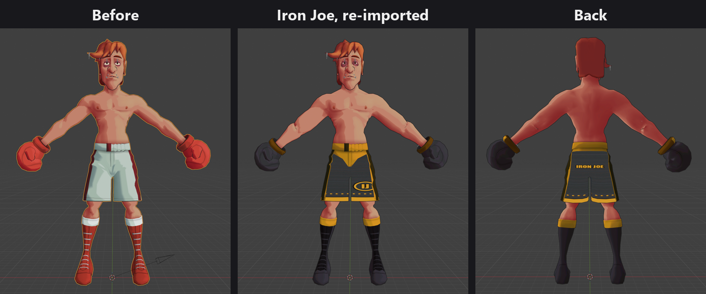

## One-time setup

1. Blender ▸ Edit ▸ Preferences ▸ Add-ons ▸ Install… ▸ pick `potools/blender/po_tools_bootstrap.py`
   ▸ enable it (1). If it does not find the tools on its own, set its **potools folder** preference (2).
   The panel underneath says which folder it loaded from.

   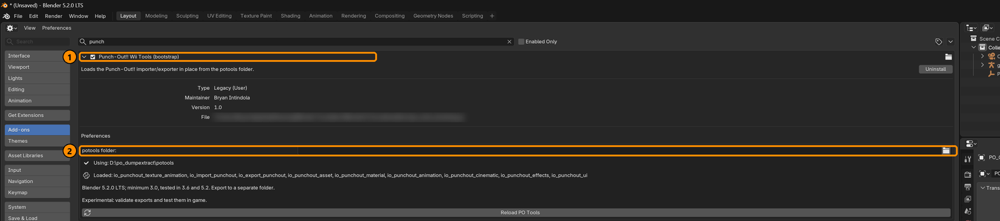

2. Keep the extracted game folder intact: the importer finds `hashid.bin` by walking up from the
   source `.dict` (for example `DATA/files/art/hashid.bin` above `DATA/files/art/characters/`).
3. Pick an output folder **outside this Git repository**, such as `D:\po_mods\ironjoe\`. The
   exporter refuses to write game files inside the repo, and it never overwrites an existing
   export, so give each attempt a fresh folder or file name.

## Make a mod (any character)

1. **Import** the character you're replacing: File ▸ Import (1) ▸ **Punch-Out!! Asset (.dict)** (2)
   ▸ select the source `.dict`. You get its armature, mesh, and animations.

   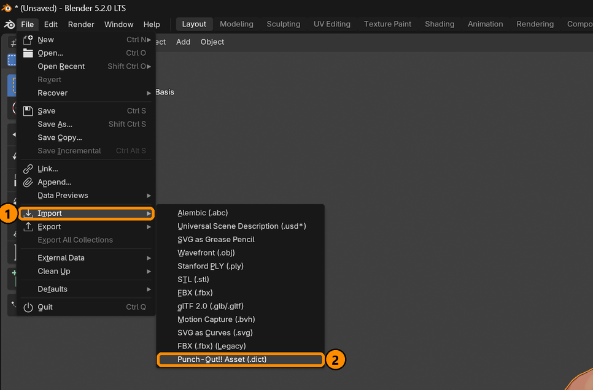

   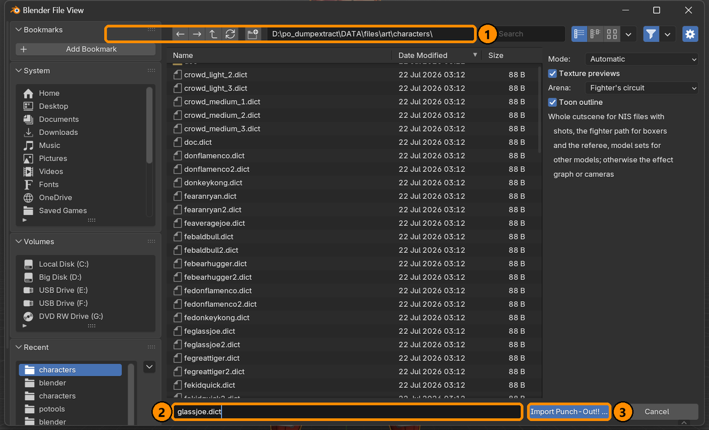

   Everything else lives in the **PO Tools** tab of the 3D view sidebar (N) (2): the slot list,
   the material editor, bone reshaping and export (1).

   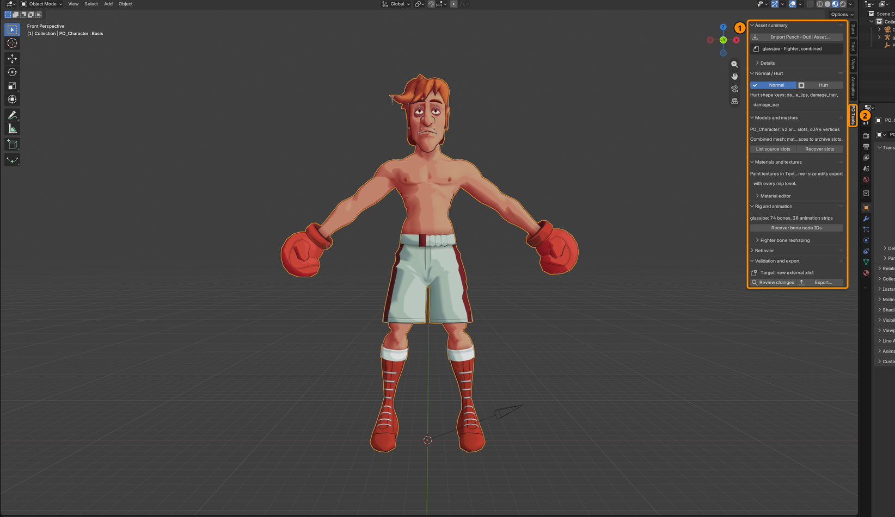

2. **Build your character** on top of that armature: parent your mesh to it (Ctrl+P ▸ Automatic
   Weights), clean weights (Preserve Volume on the Armature modifier; Weight ▸ Limit Total = 4) or
   whatever you wanna do. You're going to need to spend time tweaking all that regardless.
   Editing the imported mesh directly also works and keeps the game's weights. Iron Joe's arms and
   chest were pushed outward along their bones, with every shape key moved by the same amount
   so blinks and hurt faces still line up.

   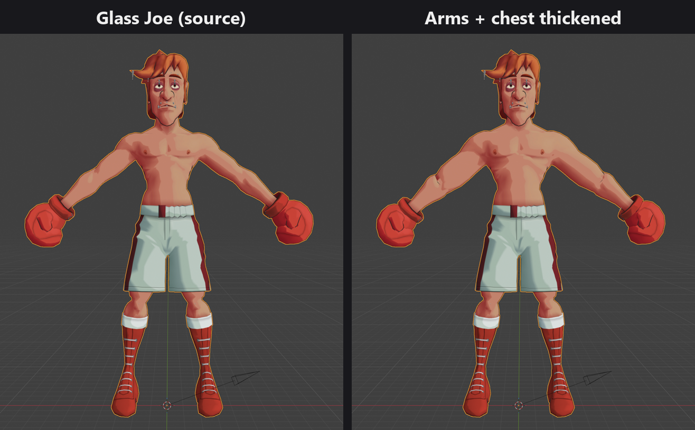

3. **Assign materials = slots.** Each Blender material maps to one of the source character's mesh
   slots. Resolution order:
   - `mat['po_slot'] = N`: the explicit custom property written by the importer and by
     **PO: Make Custom Game Material**.
   - `slotN` (e.g. `slot11`) targets that exact slot, a compact fallback for older scenes.
   - Not sure which slot is which? PO Tools ▸ Models and meshes ▸ **List source slots**. It prints
     every slot's index / name / vert count / ramp to the system console
     (Window ▸ Toggle System Console on Windows).

   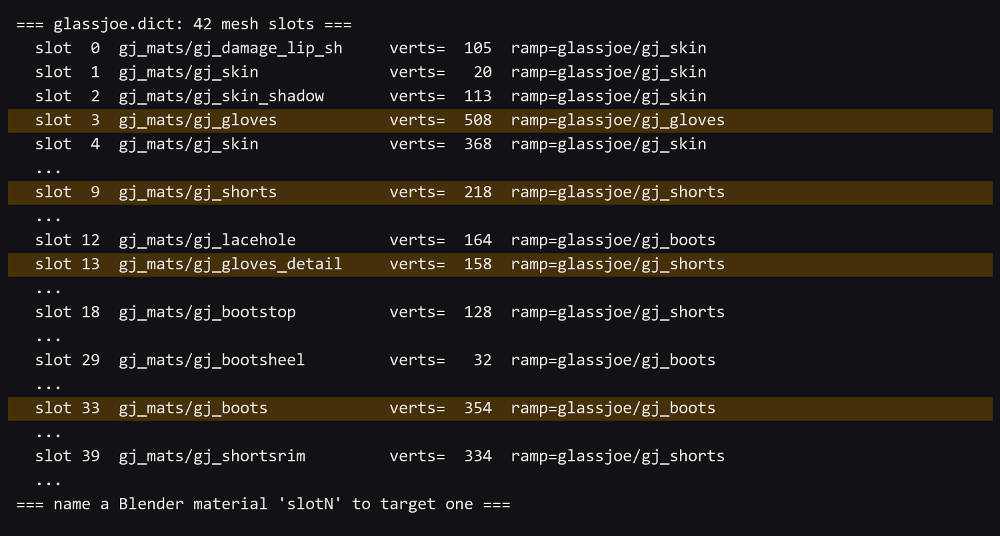

4. **Recolor.** How depends on the material:
   - **Imported materials** (everything the importer made) have no Base Color. Select the part,
     open PO Tools ▸ Materials and textures ▸ **Material editor**, and edit the **Diffuse / toon
     ramp**: keep each stop's brightness and change its hue, and the cel shading survives. The
     viewport keeps previewing the source's exact ramp until you set the material's
     `PO_RampSource` node to 1 in the Shader Editor; the export uses your edited ramp either way.
     If a part's **Detail / albedo** texture is tinted (Glass Joe's glove cuffs and boots are red
     in the detail map), give it a greyscale copy, or the tint multiplies into your new color.
   - **Your own materials** (a plain Principled BSDF): set **Base Color**. The export's color bake
     writes that flat color into the slot's ramp.

   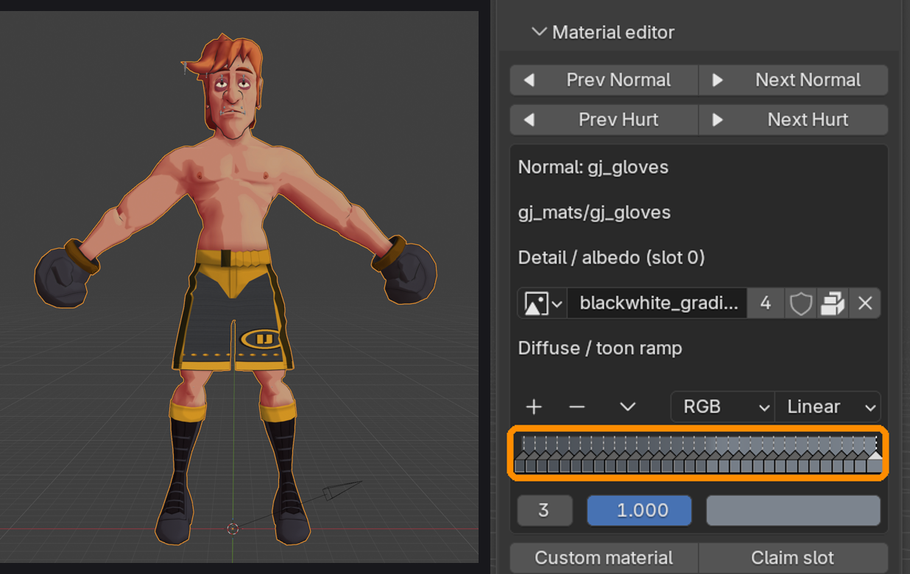

5. **Export:** File ▸ Export (1) ▸ **Punch-Out!! Asset (.dict)** (2).

   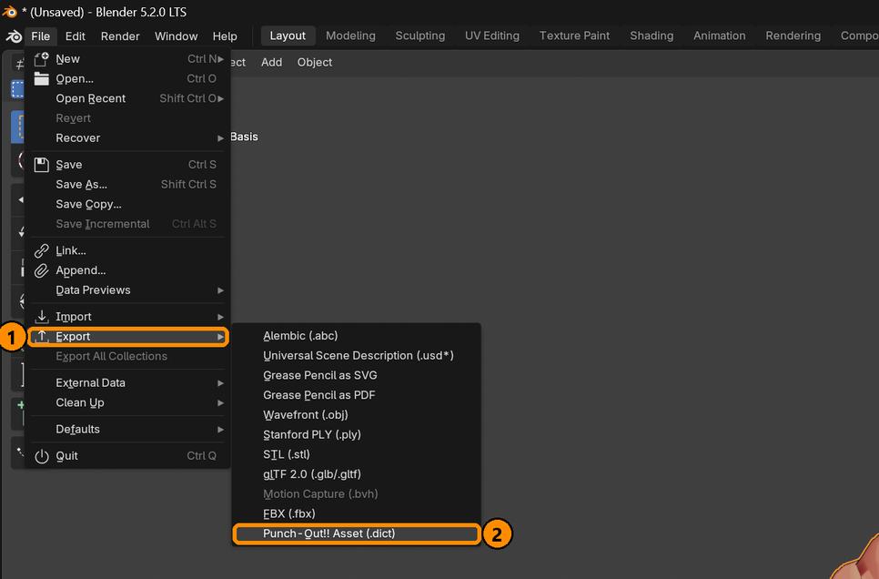

   Browse to your output folder (1) and keep the source's file name (2): `glassjoe.dict` for a
   Glass Joe mod. Leave the options at their defaults (3), then press Export (4).
   **Source character** is filled in from the imported mesh/armature. If you browse to a
   different base character, that choice is saved in the `.blend` and reused next time.
   Geometry, weights, bone palettes, and materials are written together as `.dict` + `.data`.

   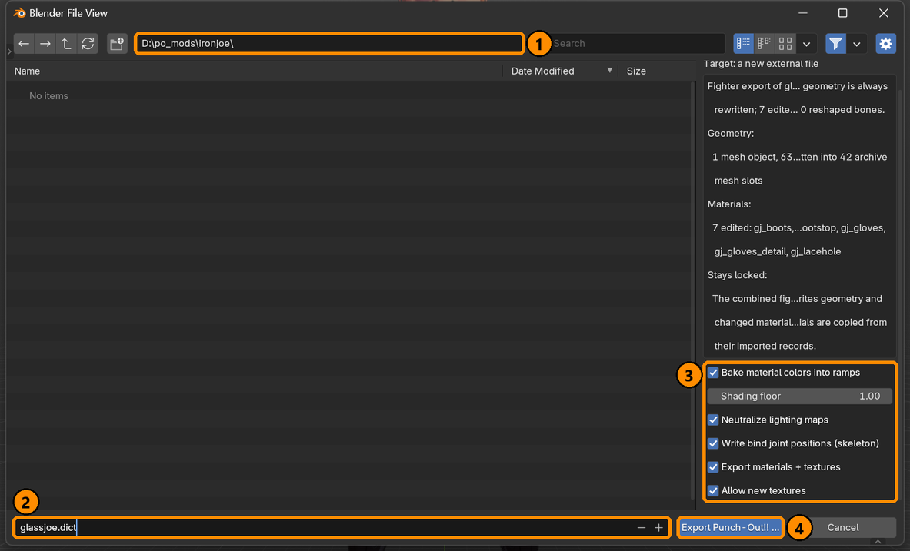

6. **Validate** (see [Check it before you boot it](#check-it-before-you-boot-it)), then **boot it:**
   drag your files into your Riivolution folder with the proper directory setup and bang!
   See [DOLPHIN_TESTING.md](DOLPHIN_TESTING.md).

## Full custom materials

1. On the authored mesh, make a normal Blender material with **one Image Texture node connected to a
   Principled BSDF node's Base Color**. UV-map it normally; seams are fine, since the exporter
   splits vertices wherever UVs differ. Keep the texture opaque and use dimensions divisible by 8
   where possible (for example 256×256 or 512×512).
2. Choose the target mesh slot with **List source slots**. It can be the slot this part already
   uses (Iron Joe's trunks stay on slot 9) or an unused one. This is only a geometry/bone
   allocation: its old material will be replaced, not reused.
3. Make the material active and press PO Tools ▸ Material editor ▸ **Custom material**. (F3 search
   only finds it with Preferences ▸ Interface ▸ Developer Extras turned on.)

   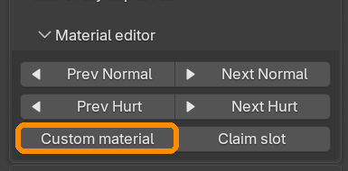

   In the dialog, set:

   - **Target slot** to the selected slot;
   - **Material name** to something you'll recognize;
   - **Surface response** to `cloth`, `skin`, `boot`, `metal`, etc.; and
   - leave **Use diffuse image as painted** checked for a normal hand-painted diffuse.

   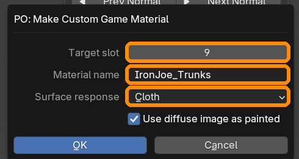

4. The operator replaces the material on that object with a game-accurate
   shader graph. Your texture is now its `PO_Detail` (the real game albedo texture),
   and `PO_Ramp` is white so a dark source ramp cannot multiply your art into muddy black.
   It also writes the `po_slot` assignment automatically.

   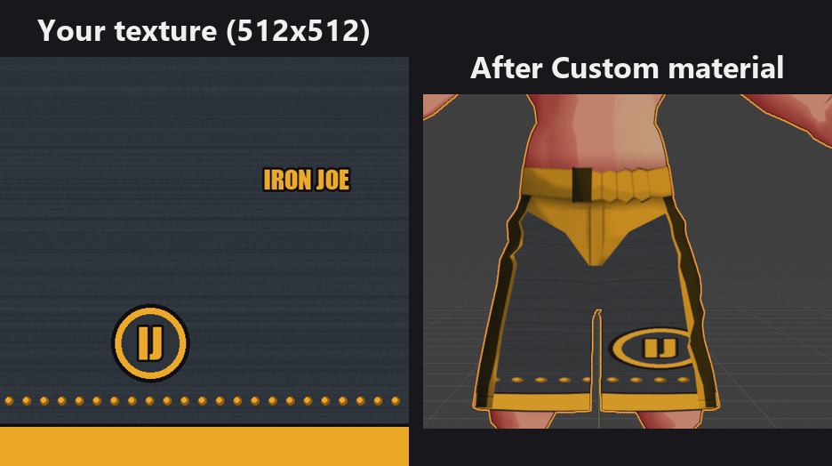

5. Export with **Export materials + textures** and **Allow new textures** enabled. The exporter
   emits an independent CMPR texture entry, writes every mip level, creates a new 204-byte
   material record, and repoints only the selected mesh slot. Shared source textures are forked
   automatically rather than overwritten.
6. Validate before booting:

```bash
python potools/tools/validate_mod.py D:/po_mods/ironjoe/glassjoe.dict art/characters/glassjoe.dict
```

The game-side shader remains the original `hippodiffuseskin` selected by the mesh record, so the part receives the normal Punch-Out arena lighting, specular response and rim effects. The source slot is no longer the source of its diffuse texture or material record. You still cannot invent a ninth shader texture stage without changing `main.dol`; use the available detail, ramp, rim, HDR and fresnel inputs instead.

## Notes

- **Color bake**: recolors the ramp of each slot whose material is a plain Blender material, from
  its Base Color. "Shading floor" controls how dark the unlit end gets (higher = flatter).
  Imported materials you left alone are never baked, and edited ones go through the material
  export instead. Turn baking off to keep the source character's textures.
- **Shared textures**: the exporter forks a shared texture before changing it, so a material you
  author does not recolor another slot that happens to reference the same source texture.
- **Everything not mapped** is zeroed, so none of the original character's geometry shows through.
- **Read the export report.** If the materials stage fails, the export still writes the geometry and
  says so as a warning ("Geometry written OK, but materials failed"). Re-importing the exported
  `.dict` into an empty scene is the quickest way to see what actually shipped.

## Check it before you boot it

```bash
python potools/tools/validate_mod.py D:/po_mods/yourmod/yourchar.dict art/characters/yourchar.dict
```

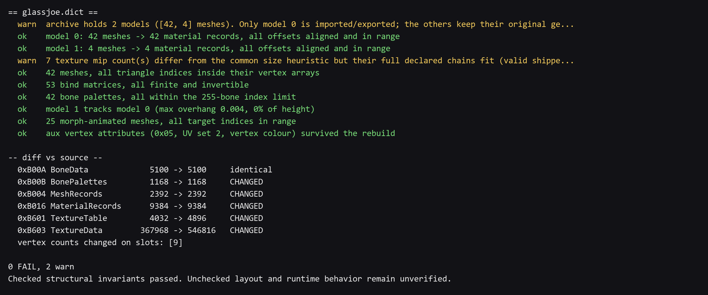

Booting to find out costs two minutes and tells you one bit: froze, or didn't. This tells you
_which_ checked invariant broke, in about a second. Exit 0 means the implemented structural
checks passed; it does not guarantee a successful boot or correct rendering.

Headless Blender tests back the exporter itself (set `PO_FIXTURE_ROOT` to your dump's `art`
folder for the fighter cases):

```bash
blender --background --factory-startup --python-exit-code 1 --python potools/tests/blender/blender_fighter_roundtrip.py
blender --background --factory-startup --python-exit-code 1 --python potools/tests/blender/blender_material_roundtrip.py
```

## Problems that came and what caused them

| in-game                                                             | cause                                                                                                                                                                                                                                                                                                                                                                                                          |
| ------------------------------------------------------------------- | -------------------------------------------------------------------------------------------------------------------------------------------------------------------------------------------------------------------------------------------------------------------------------------------------------------------------------------------------------------------------------------------------------------- |
| **Character floats above the canvas**                               | You lowered the hips; the hip height is baked into the _animation_, not the skeleton. The exporter now shifts every animation's world root track by the same delta. If it still floats, the root node was not found — check the export report for "root motion retargeted".                                                                                                                                    |
| **Stripes / banding on flat colour**                                | CMPR uniform blocks emitted in 3-colour _punch-through_ mode (`c0 == c1`). Fixed; the encoder now emits `c0 > c1` on every uniform block.                                                                                                                                                                                                                                                             |
| **Original colours return at distance**                             | Only mip level 0 was recoloured. Textures store a full mip chain and the GPU picks a smaller level as the camera pulls back — 20 of the referee's 31 textures are mipped. The bake now walks every level.                                                                                                                                                                                                      |
| **Hang on load**                                                    | A dangling pointer: a `materialOffset` off a record boundary, or a texture whose declared mip count runs past the end of the pixel chunk. `validate_mod.py` catches both.                                                                                                                                                                                                                                      |
| **Face tears or spikes when he blinks**                             | Morph deltas address vertices by _local index_, and the exporter renumbers them. They are now remapped by position; deltas with no match are dropped rather than left pointing at the old numbering.                                                                                                                                                                                                           |
| **Black wedges / bands through the model that Blender never shows** | The **shadow volume**. Every character archive holds a second model (`shadow_volume/shadow`, 4–7 meshes) that is skinned to the same skeleton but never imported. Reshape the character and it stays the original size — a full-height black hull sticking out through the cap and shoulders. The export now re-poses it through the same change of bind pose; `validate_mod.py` FAILs if it still sticks out. |
| **Everything comes out black, or dark and blotchy**                 | The three vertex attributes Blender cannot author — `0x05` (tangent), `0x3D` (a second UV set), `0xE9` (vertex colour RGBA8) — were written as zeros. Zeroed vertex colour is black at alpha 0. They are now resampled from the source mesh; `validate_mod.py` FAILs if any of them come back empty.                                                                                                           |
| **You painted a texture and got a flat colour**                     | The **colour bake** and the **material export** were fighting. The bake runs first and flattens a slot's ramp to one colour; the material export then leaves any material it considers pristine alone, so the flat colour shipped. The bake now skips every slot the material export writes, and says which in the report. Keep **Export materials + textures** ticked and your image goes in at its own size. |
| **A part wears the wrong material entirely**                        | The custom material was not converted before export, or two visible Blender materials claim the same target slot. Run **PO: Make Custom Game Material** for the diffuse-textured material; every visible material needs its own target slot.                                                                                                                                                                   |
| **Limbs blow out into spikes**                                      | Bind joint positions were left at the original rig. Keep **Write bind joint positions** ticked.                                                                                                                                                                                                                                                                                                                |
| **An arm or leg twists only in-game**                               | The Blender bone's roll/direction was copied into a game whose animations use the source rig's axes. Re-export with the current exporter: it writes joint positions but retains the source animation axes.                                                                                                                                                                                                     |
| **Character came out the original size**                            | Node offsets not rewritten — the export refuses this case rather than shipping it. Run "PO: Recover Bone Node IDs".                                                                                                                                                                                                                                                                                            |
